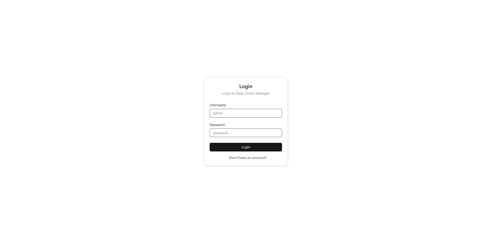
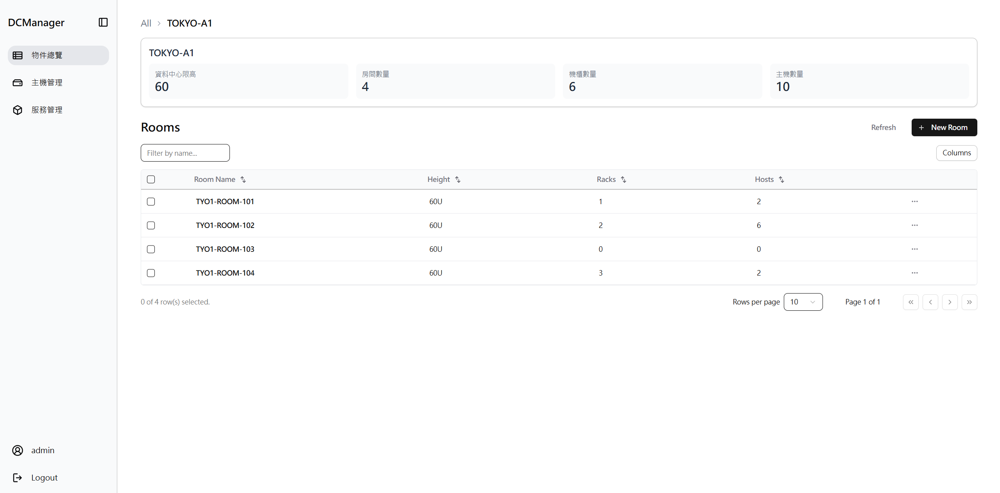
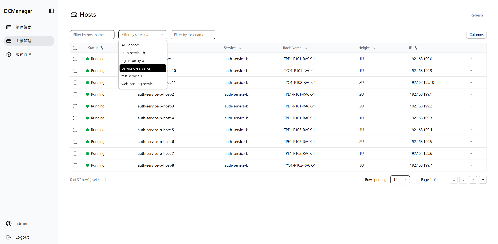
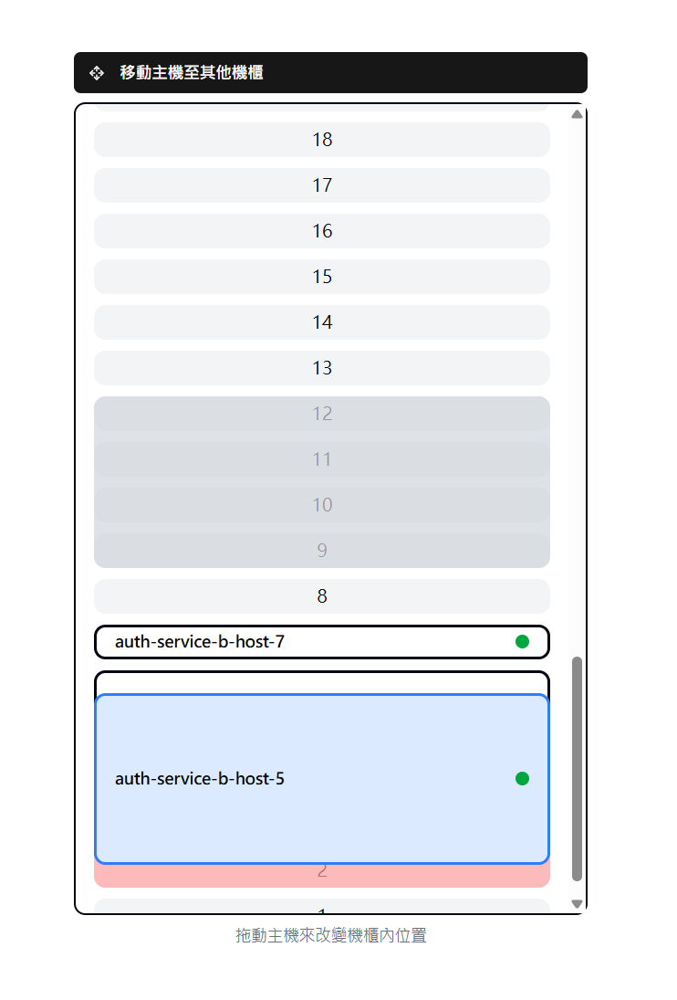
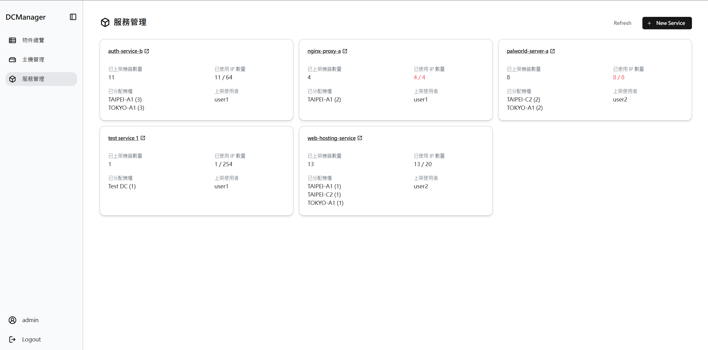
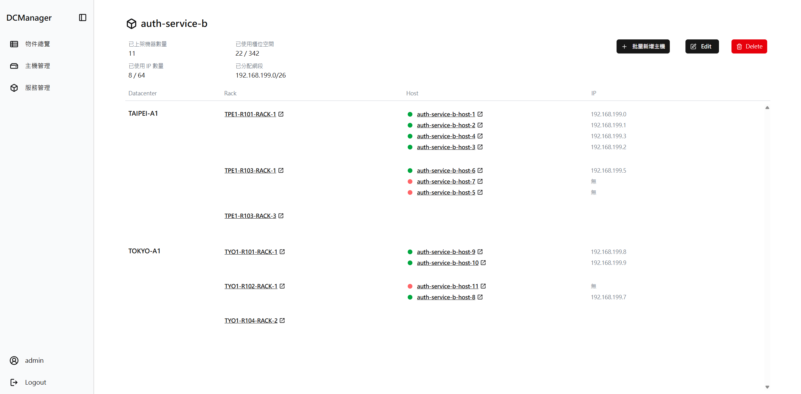

# DCManager

Data Center Management System  
Final Project for NTU Cloud Native 2025  

Demo site: (The Demo site is deprecated since we don't have enough GCP credits 😢, but you could still run this project by cloning it.)  
Demo video: 
https://github.com/user-attachments/assets/2c4b798a-3395-4a9d-bb01-318d48cd9e0e


### UI Preview
<div align="center">
  
  **Login page**
  
  
  **Datacenter overview**
  
  
  **Host overview**
  
  
  **Moving the host in the rack / between racks**
  <div>
    
  </div>
  <br/>
  
  **Service overview**
  
  
  **Serivce view**
  
</div>

## Run This Project
> [!IMPORTANT]
> This repo using git submodule, so don't just `git clone`, use this:
>
> ```
> git clone git@github.com:Tanimal19/DCM.git --recursive
> ```


### Docker Compose (Local)
```
# 啟動所有服務（背景）
docker-compose up -d

# 重新建構並啟動服務
docker-compose up -d --build

# 重新建構並重啟指定服務
docker-compose up -d --build <service>

# 查看 container 狀態
docker-compose ps

# 查看指定服務的即時日誌
docker-compose logs -f <service>

# 關閉所有服務
docker-compose down
```

### GCP Deploy
(gitHub action will automatically deploy, use this only if you want to deploy manually)
```
./deploy.ps1 <frontend | backend | both>
```
